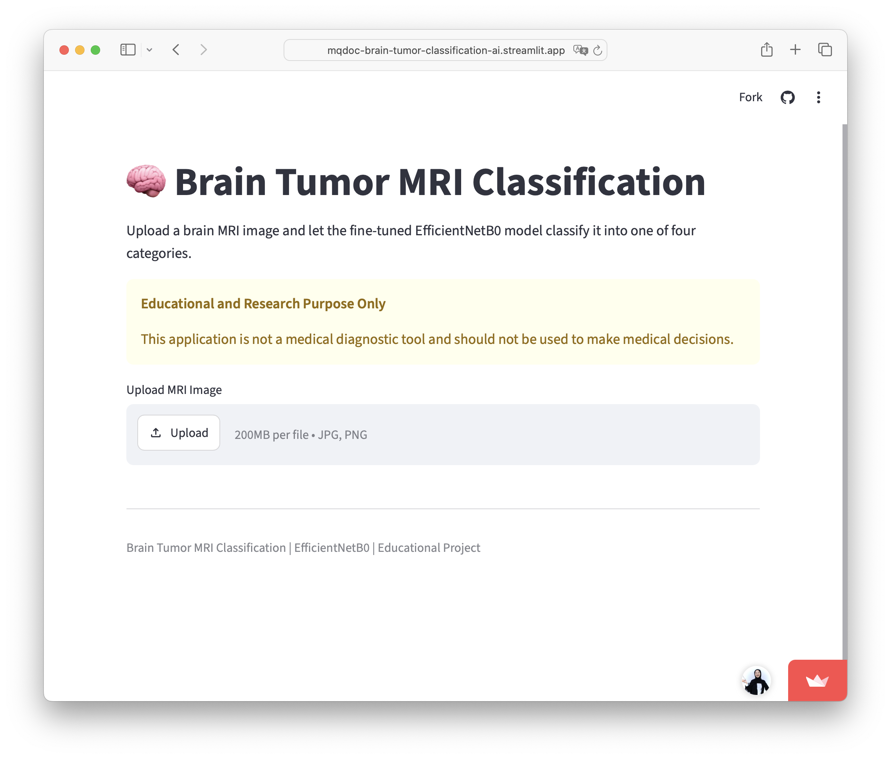
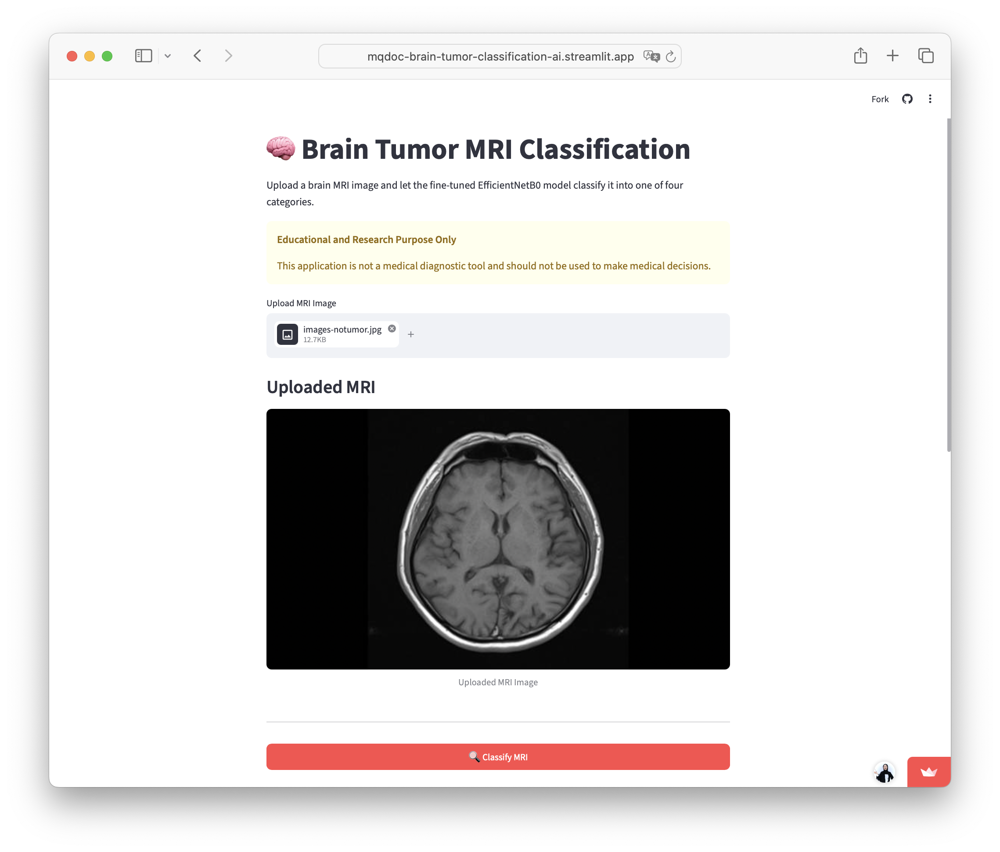
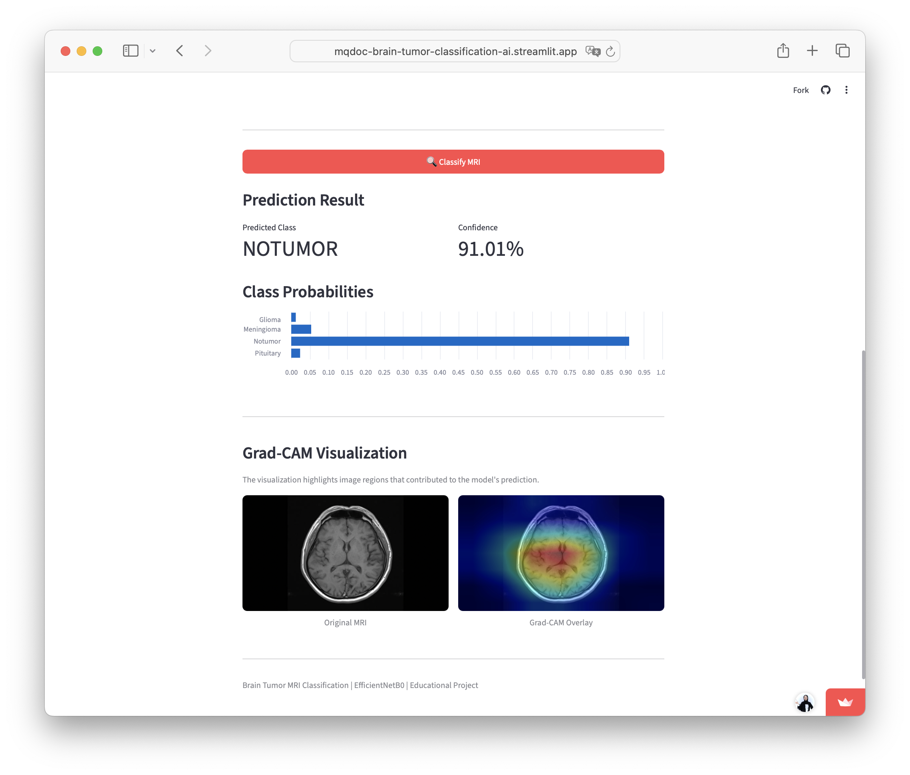
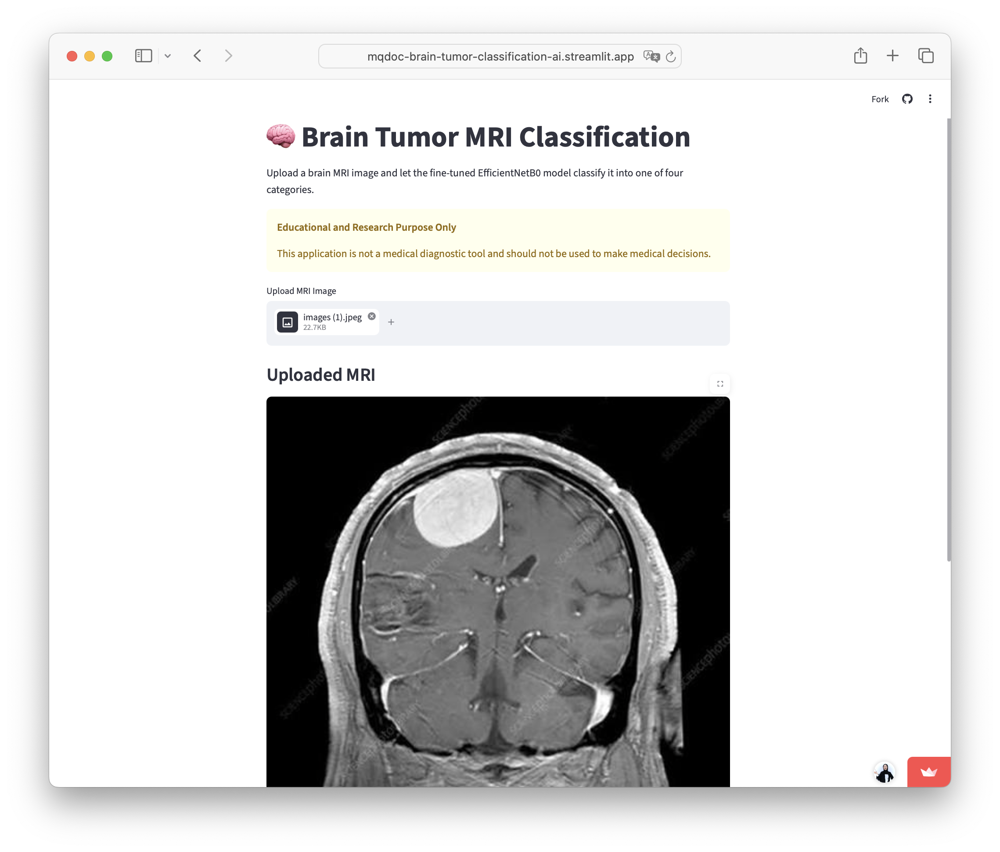
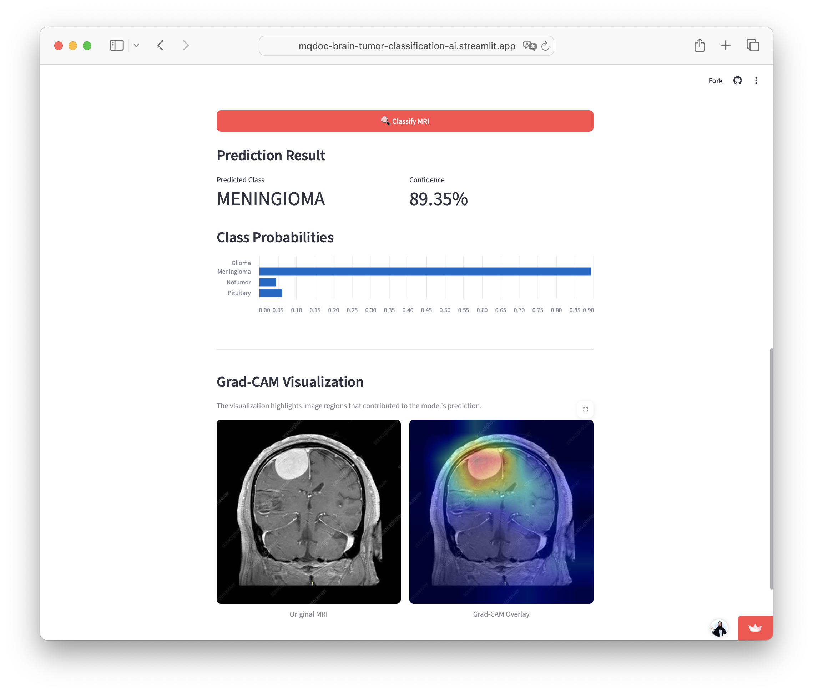

# Brain Tumor MRI Classification using Deep Learning

## 🌐 Streamlit Web Application

The trained EfficientNetB0 model was deployed as an interactive web application using Streamlit.

The application allows users to:

- Upload an MRI image
- Classify the MRI into one of four classes
- View the predicted class and confidence score
- View class probability distribution
- Visualize Grad-CAM to provide insight into the image regions influencing the prediction

### 🚀 Live Demo

The application is publicly available through Streamlit Community Cloud.

**Live Demo:** https://mqdoc-brain-tumor-classification-ai.streamlit.app/ 

> The application is intended for educational and research purposes only and is not a medical diagnostic tool.

### 📸 Application Screenshots

#### Main Dashboard



The main dashboard provides the entry point for the MRI classification application.

#### MRI Upload — No Tumor



The application allows users to upload an MRI image before running the classification process.

#### Classification Result — No Tumor



The application displays the predicted class, confidence score, class probabilities, and Grad-CAM visualization.

#### MRI Upload — Meningioma



Example of an MRI image uploaded for classification.

#### Classification Result — Meningioma



Example classification result showing the model prediction and supporting visual analysis.
## Overview

Brain tumors are abnormal cell growths in the brain that require early detection for effective treatment. This project develops a deep learning model capable of classifying brain MRI images into four categories using Transfer Learning.

This project is intended for educational and research purposes only and should not be used as a medical diagnosis tool.

---

## Objectives

- Build a deep learning model for brain tumor classification.
- Apply transfer learning using EfficientNetB0.
- Evaluate model performance using multiple metrics.
- Visualize model predictions with Grad-CAM.
- Deploy the model as a web application.

---

## Dataset

- Total Images: 7,200
- Training Images: 5,600
- Testing Images: 1,600

Classes:

- Glioma
- Meningioma
- Pituitary
- No Tumor

---

## Tech Stack

- Python
- TensorFlow
- OpenCV
- NumPy
- Pandas
- Scikit-Learn
- Matplotlib
- FastAPI
- Streamlit

---

## Project Structure

## 📁 Project Structure

```text
Brain-Tumor-Classification-AI/
│
├── app/
│   └── app.py
│       # Streamlit web application for MRI classification
│       # Includes prediction, confidence score, class probabilities,
│       # and Grad-CAM visualization
│
├── data/
│   └── raw/
│       ├── Training/
│       │   ├── glioma/
│       │   ├── meningioma/
│       │   ├── notumor/
│       │   └── pituitary/
│       │
│       └── Testing/
│           ├── glioma/
│           ├── meningioma/
│           ├── notumor/
│           └── pituitary/
│       # MRI dataset used for training and evaluation
│       # Not included in the GitHub repository
│
├── documentation/
│   ├── main-dashboad.png
│   ├── notumor-upload.png
│   ├── notumor-analysis.png
│   ├── meningioma-upload.png
│   └── meningioma-analysis.png
│       # Screenshots of the deployed Streamlit application
│
├── docs/
│   └── project_plan.md
│       # Project planning and development documentation
│
├── models/
│   └── efficientnetb0_finetuned.h5
│       # Fine-tuned EfficientNetB0 model used by the application
│
├── notebooks/
│   ├── 01_eda.ipynb
│   ├── 02_preprocessing.ipynb
│   ├── 03_finetuning.ipynb
│   └── 04_evaluation.ipynb
│       # Jupyter notebooks for experimentation,
│       # preprocessing, model training, and evaluation
│
├── src/
│   # Source code and reusable project components
│
├── .gitignore
│   # Files and directories excluded from version control
│
├── CHANGELOG.md
│   # Project development history and changes
│
├── README.md
│   # Project documentation
│
├── ROADMAP.md
│   # Project development roadmap
│
├── requirements.txt
│   # Python dependencies
│
└── notes - Brain Tumor Project.docx
    # Project notes and development references
```

---

## Roadmap

- Project Setup
- Dataset Analysis
- Data Preprocessing
- Model Training
- Model Evaluation
- Explainable AI
- Deployment

---

## Disclaimer

This project is developed for research and educational purposes only.
It must not be used for medical diagnosis.

---

## Disclaimer
By MaziyaQofi 2026